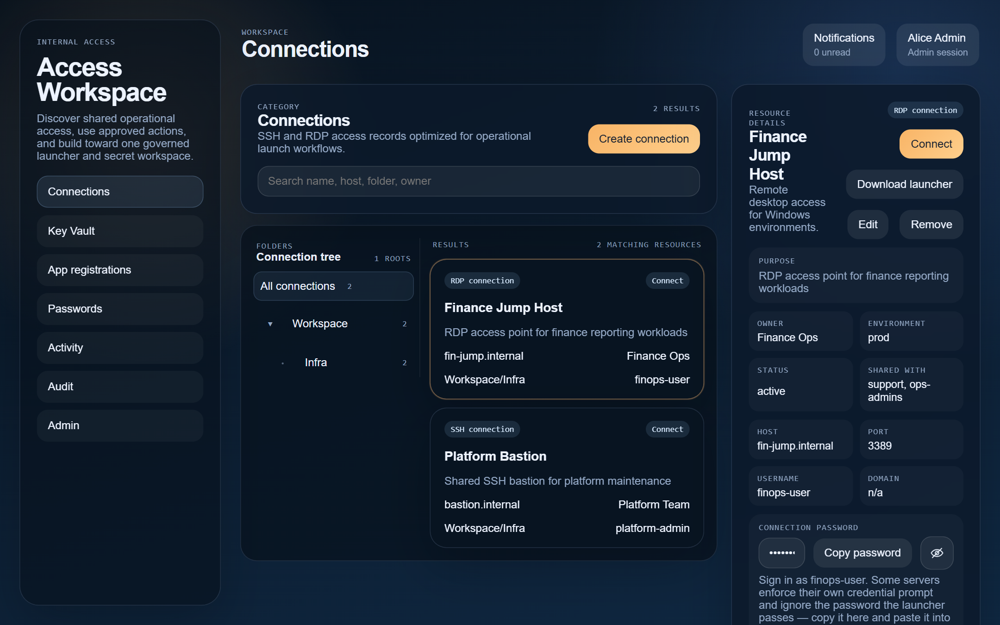
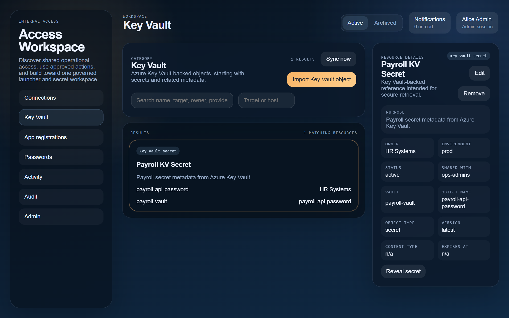
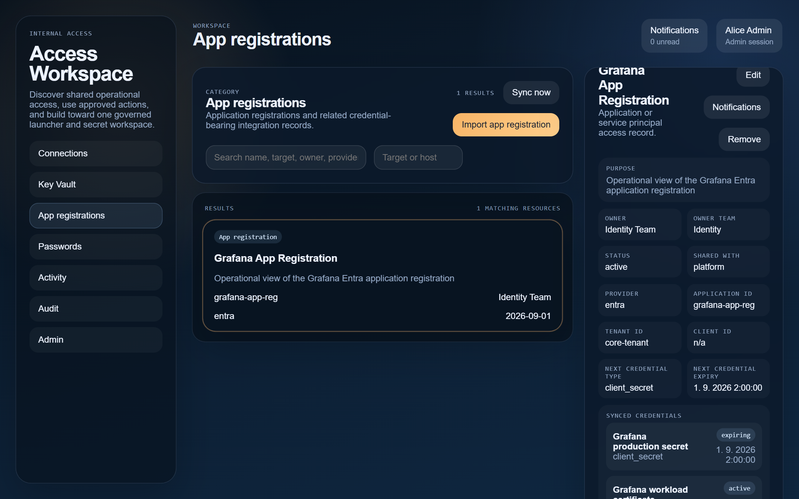
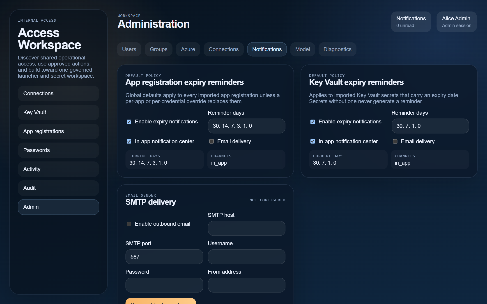

# Access Workspace

**One place for the shared access your team actually uses every day — connections, secrets, app registrations, and portal logins — with real permissions, real encryption, and an audit trail.**

Self-hosted. Open source. Built for internal operations teams.

---

## The problem

Shared operational access ends up scattered: RDP and SSH details in a connection manager on one person's laptop, secrets in Azure Portal five clicks deep, portal logins pasted into chat, app registration credentials quietly expiring until something breaks at 2am. Nobody can answer *who has access to what, and why* without reconstructing it by hand.

Access Workspace pulls that into one workspace where access is discoverable, permissions are explicit, secrets stay encrypted, and every sensitive action is logged.



## What it does

### Connections — a launcher-first RDP and SSH catalog

Shared connections live in the workspace with folder organization, per-connection credentials, and permissions. Connecting hands off to a small local launcher that opens the native client on your machine — **mstsc on Windows, FreeRDP on Linux** — with the credential injected straight from the vault. Remote Desktop Gateway, admin sessions, multi-monitor and window options are carried through as connection data, not per-machine setup. Secrets never travel in a browser URL: the web app requests a one-time launch ticket that only the launcher can redeem.

Users can attach **their own saved credentials** to a shared connection, so a jump host shared with the whole team can still be entered with each person's individual account.

### Key Vault — a usable operational surface for Azure

Discover secrets in your vaults, import them in batches, and browse them with the metadata that matters: owner, environment, content type, expiry, enabled state. Values are **never copied into the database** — a reveal fetches the live value from Azure on demand, under policy, and is audited. Sync runs on a schedule, auto-import can apply default ownership, and a secret that genuinely disappears from Azure is archived only after a direct lookup confirms it is gone.



### App registrations — credential risk you can see coming

Import Entra app registrations with their owners and their full secret/certificate inventory. Credential expiry is tracked as first-class data and drives reminders in the in-app notification center and by email, on a schedule you configure — globally, per application, or per individual credential. Rotate a credential and stale reminders retire themselves.



Key Vault secrets that carry an expiry date go through the same pipeline, with their own reminder schedule. Reminders reach the owner, the owner's team, and admins.



### Passwords and portal logins

Reusable saved credentials for websites, tools, and legacy systems, shared with groups or individual users under explicit reveal/copy policy. Web portal logins can launch straight into the browser, including passwordless portals where only the URL and username are stored.

**Personal passwords are genuinely private.** They are sealed to a per-user vault that administrators and database operators cannot read — not "shouldn't", cannot.

### Browser extension — fill on approved portals

A companion extension for Chrome, Edge, and Firefox connects to your workspace, offers the credentials your workspace has approved for the site you are on, fills them on request, and can save new portal logins back into your personal vault. Fills are audited like any other sensitive action.

### Administration you can actually answer questions with

An admin can open a user and see their **effective access** — which categories, which actions, which local groups, which mapped Entra groups, and how it all resolved — instead of reverse-engineering it from group definitions. Add and remove group membership from there, block a user, create local accounts, or send an invite link so the new user sets their own password and no admin ever knows it.

### Security that holds up to a database dump

- **Envelope encryption** for every stored secret: a fresh per-secret data key encrypts the value, and that key is wrapped by a key-encryption key which can live inside Azure Key Vault and never leave it.
- **Personal vaults**: per-user keypairs, unlocked by your login password, a passphrase, or a passkey (Windows Hello / Touch ID). Saving never prompts; reading requires an unlocked session.
- **Hardened sessions**: httpOnly cookies, CSRF origin checks, no tokens in localStorage or redirect URLs, account lockout and per-IP throttling on auth endpoints, CSP and HSTS.
- **Audit trail** across reveal, copy, launch, fill, create/update/archive, sign-in, and vault operations.

A database dump alone yields no secret material and no session takeover. See [Security](docs/security.md) for how each layer works.

## How it fits together

One Go backend, one React frontend, one PostgreSQL database — a modular monolith, not a microservice estate. Two optional companion clients talk to the same backend: the desktop **launcher** for RDP/SSH, and the **browser extension** for portal fill. Azure/Entra provides identity and group membership; Azure Key Vault can provide both the secret values it owns and the key-encryption key.

More detail in [Architecture](docs/architecture.md).

## Quick start

Requires Docker.

```powershell
Copy-Item .env.example .env
# set RESOURCE_SECRET_KEY and POSTGRES_PASSWORD
docker compose up --build
```

Open <http://localhost:4173>. The database migrates itself, and demo users and sample data are seeded for local exploration (`alice` is an admin; the seeded password is `123456`).

For a real deployment, set `BOOTSTRAP_ADMIN_USERNAME` / `BOOTSTRAP_ADMIN_PASSWORD` instead of seeding, and read [Deployment](docs/deployment.md).

## Documentation

| Document | Answers |
| --- | --- |
| [Architecture](docs/architecture.md) | How the system is built and how the pieces talk |
| [Domain Model](docs/domain-model.md) | What the objects are and how access to them is decided |
| [Object Model](docs/object-model.md) | How each category is stored, retrieved, and kept in sync |
| [Security](docs/security.md) | Encryption at rest, personal vaults, sessions, secret modes |
| [Configuration](docs/configuration.md) | Every environment variable, auth modes, first admin |
| [Deployment](docs/deployment.md) | Running it in production, and Azure hardening |
| [Development](docs/development.md) | Running and testing locally, with and without Docker |
| [API](docs/api.md) | The HTTP surface |
| [Browser Extension Distribution](docs/browser-extension-distribution.md) | How extension builds are released and picked up |
| [Browser Extension Privacy](docs/browser-extension-privacy.md) | What the extension handles, for store review |

## Contributing

Contributions are welcome — see [CONTRIBUTING.md](CONTRIBUTING.md) for how to build, test, and submit changes, and [CODE_OF_CONDUCT.md](CODE_OF_CONDUCT.md) for the ground rules. Security issues have their own path: [SECURITY.md](SECURITY.md).

## License

Released under the [MIT License](LICENSE). Copyright (c) 2026 Martin Kerhat.
